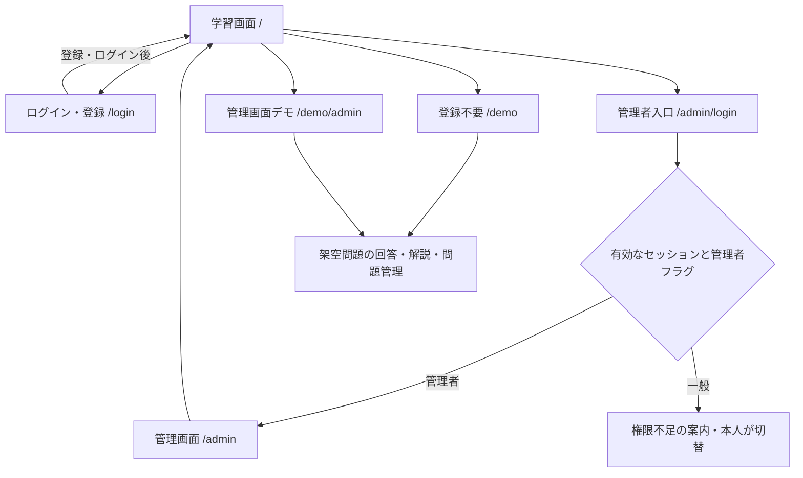

# CodeStep ワークフロー（画面遷移図）

学習画面、ログイン、管理画面、登録不要デモの画面遷移を示します。

```mermaid
flowchart TD
  H[学習画面 /] --> L[ログイン・登録 /login]
  L -->|登録・ログイン後| H
  H --> A[管理者入口 /admin/login]
  A --> C{有効なセッションと管理者フラグ}
  C -->|管理者| Q[管理画面 /admin]
  C -->|一般| N[権限不足の案内・本人が切替]
  Q --> H
  H --> D[登録不要 /demo]
  D --> S[架空問題の回答・解説・問題管理]
  H --> AD[管理画面デモ /demo/admin]
  AD --> S
```

※この図はアプリの画面遷移を表すものです。管理者による操作は、ログイン状態と権限により制限されます。
