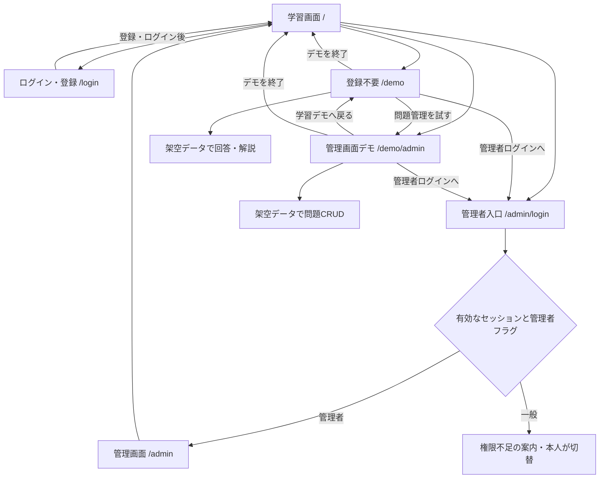

# CodeStep ワークフロー（画面遷移図）

学習画面、ログイン、管理画面、登録不要デモの画面遷移を示します。

```mermaid
flowchart TD
  H[学習画面 /] --> L[ログイン・登録 /login]
  L -->|登録・ログイン後| H
  H --> A[管理者入口 /admin/login]
  A --> C{有効なセッションと管理者フラグ}
  C -->|管理者| Q[管理画面 /admin]
  C -->|一般| N[権限不足の案内・本人が切替]
  Q --> H
  H --> D[登録不要 /demo]
  H --> AD[管理画面デモ /demo/admin]
  D -->|問題管理を試す| AD
  AD -->|学習デモへ戻る| D
  D -->|デモを終了| H
  AD -->|デモを終了| H
  D -->|管理者ログインへ| A
  AD -->|管理者ログインへ| A
  D --> S[架空データで回答・解説]
  AD --> M[架空データで問題CRUD]
```

※この図は画面遷移を表します。デモ学習とデモ管理の行き来は本番で利用できます。デモから通常学習 `/` と管理者入口 `/admin/login` へ直接戻るリンクは、PR #5のマージにより2026-10-22に本番反映済みです。管理者操作は認証・権限で制限されます。
